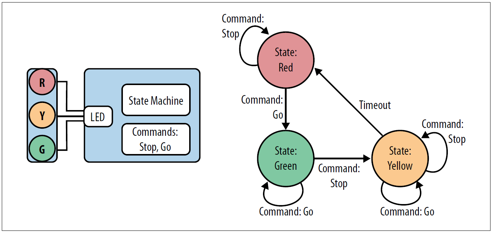

# Implementación de una FSM en C
Este repositorio contiene una implementación demostrativa de una Finite State Machine (FSM) en lenguaje C. El código implementa un semáforo con el siguiente comportamiento:


*Fuente: Making Embedded Systems. Elicia White. (2011)*

El programa usa la consola para simular los eventos de la siguiente forma:

* letra q = Salir del programa
* letra s = STOP_COMMAND
* letra t = TIMER_TIMEOUT
* letra g = GO_COMMAND

## Compilación y Ejecución
Para compilar el programa:
```
$ make
```
Para ejecutar el programa:
```
$ make run
```
o
```
$ ./programa
```
